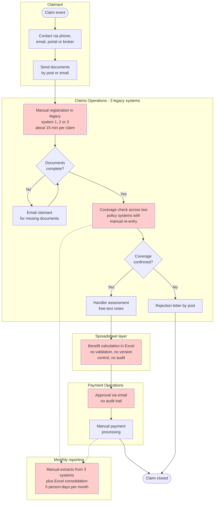
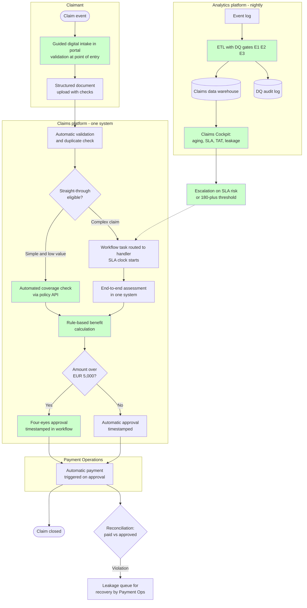

# Process Models — As-Is / To-Be Claims Handling

| | |
|---|---|
| **Related** | [BRD](BRD.md) · [FRS](../02-functional-spec/FRS.md) · [KPI Catalog](../02-functional-spec/kpi-catalog.md) |
| **Notation** | BPMN-style, rendered as Mermaid flowcharts |

## Legend

| Symbol | BPMN meaning |
|---|---|
| Rounded node `([ ])` | Start / end event |
| Rectangle `[ ]` | Task / activity |
| Diamond `{ }` | Gateway (decision) |
| Cylinder `[( )]` | Data store |
| Subgraph | Swimlane (actor / system) |
| 🔴 Red node | As-is pain point (P1–P7) |
| 🟢 Green node | To-be improvement |
| Dashed arrow | Information / reporting flow |

## 1. As-Is Process — Claims Handling Today

## 2. As-Is Pain Points — Quantified Evidence

Evidence produced by this project's baseline analysis (see [BRD §2](BRD.md)); each pain point maps to a requirement and, where applicable, to the DQ gate that now controls it.

| # | Pain point | Quantified evidence | Controlled by |
|---|---|---|---|
| P1 | Manual FNOL capture, document chase by email | ~15 min per claim; channel recorded as free text (`'phone'`, `' Phone '`) — non-comparable KPIs | FR-06, KPI-08 |
| P2 | Coverage check across 2 systems, manual re-entry | Double data entry per claim; no single claim view | FR-01/FR-02 |
| P3 | Benefit calculation in uncontrolled Excel | **€650,236.22 overpayment across 339 claims** (duplicates + erroneous re-issues, avg €1,918) | FR-07, KPI-06, gate: reconciliation |
| P4 | Email approvals — no audit trail | 0% of decisions traceable with timestamps vs. 100% required by regulator (OBJ-4) | FR-05, KPI-02 |
| P5 | Uncontrolled data entry — no catalogues | Per reference load: **45 critical rejects** (corrupt dates, decision-before-FNOL), **40 duplicates**, **261 unknown handler codes** | FR-02/FR-03, gates E1/E2/E3 |
| P6 | Monthly manual reporting, 5 person-days | Backlog invisible between month-ends; year-end 2024: **6,814 open, 1,168 over 180 days** | OBJ-1/2, FR-04, KPI-03 |
| P7 | No escalation for aged claims | 180+ backlog tail does not drain across the whole period (Q4 trend) | BRD risk R-03 |

## 3. To-Be Process — Claims Handling with the Reporting Solution

**Key to-be elements:** straight-through processing (STP) for simple low-value claims · one system instead of three plus Excel · rule-based calculation with 4-eyes approval over EUR 5,000 · timestamped decisions (OBJ-4 evidence) · nightly ETL with DQ gates feeding the Cockpit · **two feedback loops the as-is process lacks** — the leakage queue (recovery) and the escalation loop (aging tail drains).

## 4. Gap Analysis — As-Is vs To-Be Targets

| Dimension | As-Is baseline | To-Be target | Mechanism |
|---|---|---|---|
| Reporting effort | 5 person-days/month, monthly | < 0.5 days, daily | Automated Cockpit (OBJ-1) |
| Backlog visibility | Month-end Excel only | Daily by team, drillable | KPI-03, FR-04 |
| Disability TAT | P90 = 49 days vs SLA 21 | P90 ≤ SLA; structural fix via SLA recalibration (BRD R-01) | KPI-01 + escalation loop |
| Payment accuracy | €650K undetected leakage | Violations flagged ≤ 24 h | Daily reconciliation (KPI-06) |
| Data quality | Unmeasured | 24 automated assertions, build fails on violation | DQ suite + CI |
| Regulatory evidence | Not producible | 100% traceable, timestamped | Workflow + KPI-02 |

## 5. Traceability: Pain Point → Requirement → Implementation

| Pain | Requirement | Implemented as |
|---|---|---|
| P1 | FR-06, KPI-08 | Channel catalogue + Q8 adoption trend |
| P2 | FR-01/02 | Policy join, LOB derived at load |
| P3 | FR-07, DQ-02 | Q6/Q9 reconciliation, test T21 |
| P4 | OBJ-4, FR-05 | Decision timestamps, Q1/Q2 TAT report |
| P5 | FR-02/03, DQ-01 | ETL gates E1–E3, `dq_audit_log`, CHECK constraints, 24 tests |
| P6 | OBJ-1/2, FR-04 | Snapshot fact, Q3/Q4, dashboard (planned) |
| P7 | R-03 | Escalation rule in to-be; 180+ monitoring via Q4 |
