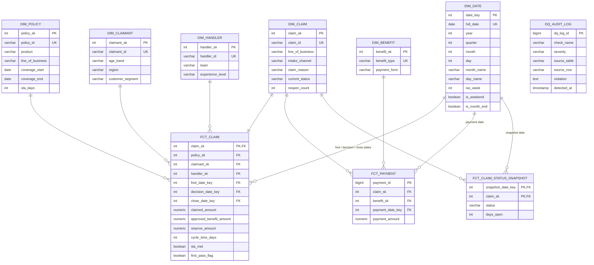

# Logical Data Model — Claims & Benefits Star Schema

SQL implementation: [`04-implementation/sql/schema/schema.sql`](../04-implementation/sql/schema/schema.sql)

## Entity-Relationship Diagram

## Grain Statements

| Table | Grain |
|---|---|
| `fct_claim` | One row per claim (latest lifecycle state) |
| `fct_payment` | One row per payment transaction |
| `fct_claim_status_snapshot` | One row per open claim per day |

## Key Design Decisions

| # | Decision | Rationale |
|---|---|---|
| 1 | Star schema with surrogate keys (`GENERATED ALWAYS AS IDENTITY`) | Decouples warehouse from legacy business keys; insulates against source key changes |
| 2 | No `paid_amount` in `fct_claim` | Payments live at transaction grain in `fct_payment`; total paid = `SUM()`. Payment accuracy (KPI-06) becomes a real cross-fact reconciliation check |
| 3 | `sla_days` in `dim_policy`, `sla_met` in `fct_claim` | SLA is a product attribute (dimension); compliance is determined at decision time (fact) |
| 4 | Daily status snapshot fact | Enables backlog/aging trend analysis — impossible with the current monthly Excel reports (OBJ-2) |
| 5 | `dq_audit_log` | Persistent evidence of data quality checks; implements the rejection log required by FR-03 |
| 6 | Smart date key `YYYYMMDD` | Human-readable, sortable, join-friendly conformed dimension |
| 7 | `dim_claim.current_status` as Type 1 attribute | Overwritten on change; history preserved in the snapshot fact |
| 8 | Status catalogue enforced by `CHECK` constraints | Directly fixes as-is pain point "no standard status codes → KPIs not comparable" |